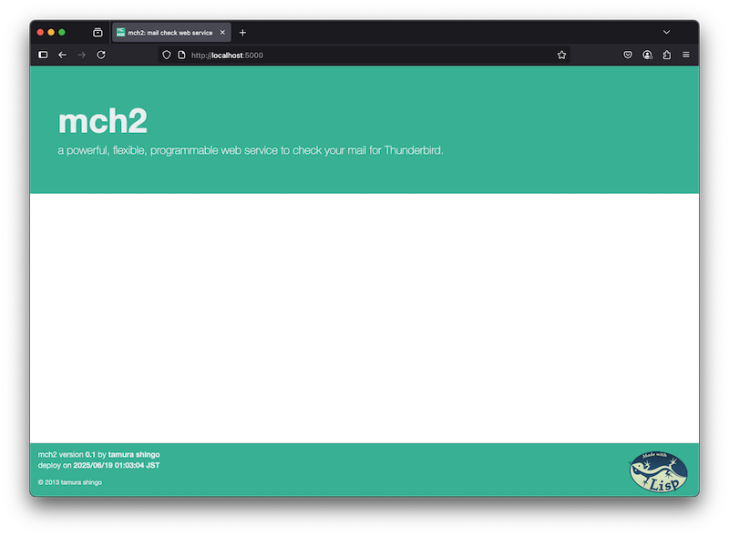

# mch2 : mail checker

メール文面が正しいかをチェックするツールです。
チェック内容は `CommonLisp` にて記述します。


※ このツールは2013年に作成したものを2025年の環境で動くように修正しています

## require

- Docker
- Thunderbird
  - Thunderbirdの拡張を使用します


## setup

docker image を作成します。

```sh
make setup
```

## 運用サーバの起動と停止

### 起動

サーバを起動します。
勝手にライブラリと mch2 を読み込んで起動します。

起動後は repl が動いている状態で待機となります。


```sh
make up
```


http://localhost:5000/ 

にアクセスして、ページが表示されればサーバが動いています。





また、 swank サーバが動いているので、 slime 等でアクセスすることができます。

```elisp
(slime-connect "localhost" 4005)
```


### 停止

make から停止させます。

```lisp
make down
```

repl から `(exit)` でも停止できます。


## 設定

チェックルールを登録することで Thunderbird 側でチェックが行えるようになります。
チェックルールは複数のチェックロジックで構成されます。

```lisp
; ルール一覧の表示
(mch2:show-all-rules)

; ルールが使用しているロジックの表示
(mch2:show-rule "RULE-NAME")

; ルールの追加
(mch2:set-rule "MAIL-INTERNAL"
               '("DOMAIN-INTERNAL-ONLY-P"))


; ルールの削除
(mch2:del-rule "MAIL-INTERNAL")
```


### ロジックの追加

`def-logic` マクロを使ってロジックを追加します。
`OK` か `NG` で結果を返すように作ってください。

```lisp
(def-logic domain-internal-only-p (mail)
  (loop for address in (append (mch2-mail::send-to mail)
                               (mch2-mail::send-cc mail)
                               (mch2-mail::send-bcc mail))
    when (not (mch2-util:string-ends-with "@mydomain" address))
      return (ng (format nil "あて先に社外アドレスがあります。:~A" address))
    finally
      (return (ok "あて先に問題はありません"))))
```

サンプルは `basic.lisp` を参照してください。


## Thunderbird側の設定

mch2 をインストールすると、メール作成ウィンドウの右下に mch2 のボタンが追加されます。
Config でサーバ情報を使用者情報を入力します。

サーバはポー番号まで入力してください。初期設定は 5000 番です。

### チェック

メール本文、あて先等を入力したら、右下の CHECK ボタンを押し、サーバ側でメールのチェックを行います。

使用するルールを選択し、CHECK ボタンを押下します。


チェック結果が表示されます。


このツールはチェックだけなので、チェックで異常が発生してもメールはそのまま送ることができます。


## 開発について

Makefile に開発用の docker を用意しています。


**開発用サーバの起動**

```sh
make dev.up
```

**開発用サーバの停止**

```sh
make dev.down
```

### 開発サーバでの mch2 の起動

swank サーバを動かしているので、 slime から接続します。

```elisp
(slime-connect "localhost" 4005)
```

各種環境変数を設定しているので、 `quicklisp` でそのまま読み込むことができます。

```lisp
(ql:quickload :mch2)
```

**`mch2` の起動**

```lisp
(mch2.server:start-server)
```

**`mch2` の停止**

```lisp
(mch2.server:stop-server)
```


**開発方法**

Emacs や VSCode 等でファイルを修正します。
ファイルの修正後は `mch2` を読み直します。

```lisp
(ql:quickload :mch2)
```


# License
Copyright &copy; 2013, 2025 tamura shingo
Licensed under the [MIT License][MIT].

[MIT]: http://www.opensource.org/licenses/mit-license.php
