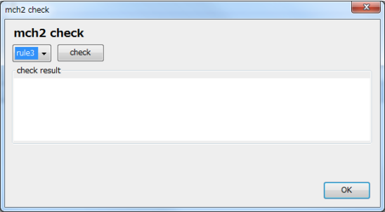
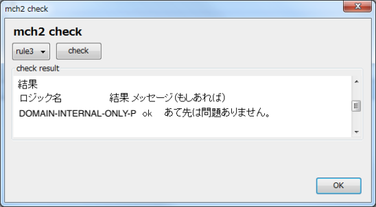

# mch2 : mail checker

メール文面が正しいかをチェックするツールです。
チェック内容は `CommonLisp` にて記述します。


## require

- Common Lisp 処理系
  - SBCLでテスト済み
- Thunderbird
  - Thunderbirdの拡張を使用します


## サーバの起動と停止

### 起動

`mch2` をロードします

```lisp
(ql:quickload :mch2)
```

サーバを起動させます。

```lisp
(mch2.server:start-server)
```

http://localhost:5000/

にアクセスして、ページが表示されればサーバが動いています。


### 停止

```lisp
(mch2.server:stop-server)
```


## 設定

チェックルールを登録することで Thunderbird 側でチェックが行えるようになります。
チェックルールは複数のチェックロジックで構成されます。

```lisp
; ルール一覧の表示
(mch2:show-all-rules)

; ルールが使用しているロジックの表示
(mch2:show-rule "RULE-NAME")

; ルールの追加
(mch2:set-rule "MAIL-INTERNAL"
               '("DOMAIN-INTERNAL-ONLY-P"))


; ルールの削除
(mch2:del-rule "MAIL-INTERNAL")
```


### ロジックの追加

`def-logic` マクロを使ってロジックを追加します。
`OK` か `NG` で結果を返すように作ってください。

```lisp
(def-logic domain-internal-only-p (mail)
  (loop for address in (append (mch2-mail::send-to mail)
                               (mch2-mail::send-cc mail)
                               (mch2-mail::send-bcc mail))
    when (not (mch2-util:string-ends-with "@mydomain" address))
      return (ng (format nil "あて先に社外アドレスがあります。:~A" address))
    finally
      (return (ok "あて先に問題はありません"))))
```

サンプルは `basic.lisp` を参照してください。


## Thunderbird側の設定

mch2 をインストールすると、メール作成ウィンドウの右下に mch2 のボタンが追加されます。
Config でサーバ情報を使用者情報を入力します。

サーバはポー番号まで入力してください。初期設定は 5000 番です。

### チェック

メール本文、あて先等を入力したら、右下の CHECK ボタンを押し、サーバ側でメールのチェックを行います。

使用するルールを選択し、CHECK ボタンを押下します。



チェック結果が表示されます。



このツールはチェックだけなので、チェックで異常が発生してもメールはそのまま送ることができます。

# License
Copyright &copy; 2013 tamura shingo
Licensed under the [MIT License][MIT].

[MIT]: http://www.opensource.org/licenses/mit-license.php
